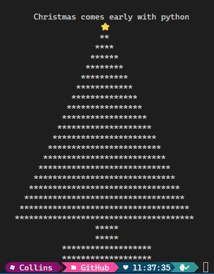

# gen.a1.python
 Learning python, this is my first mini project, creating a program that prints out a christmas tree on your terminal. 
 It's based on while loops, variables, concatenation and conditional statements.  

 
